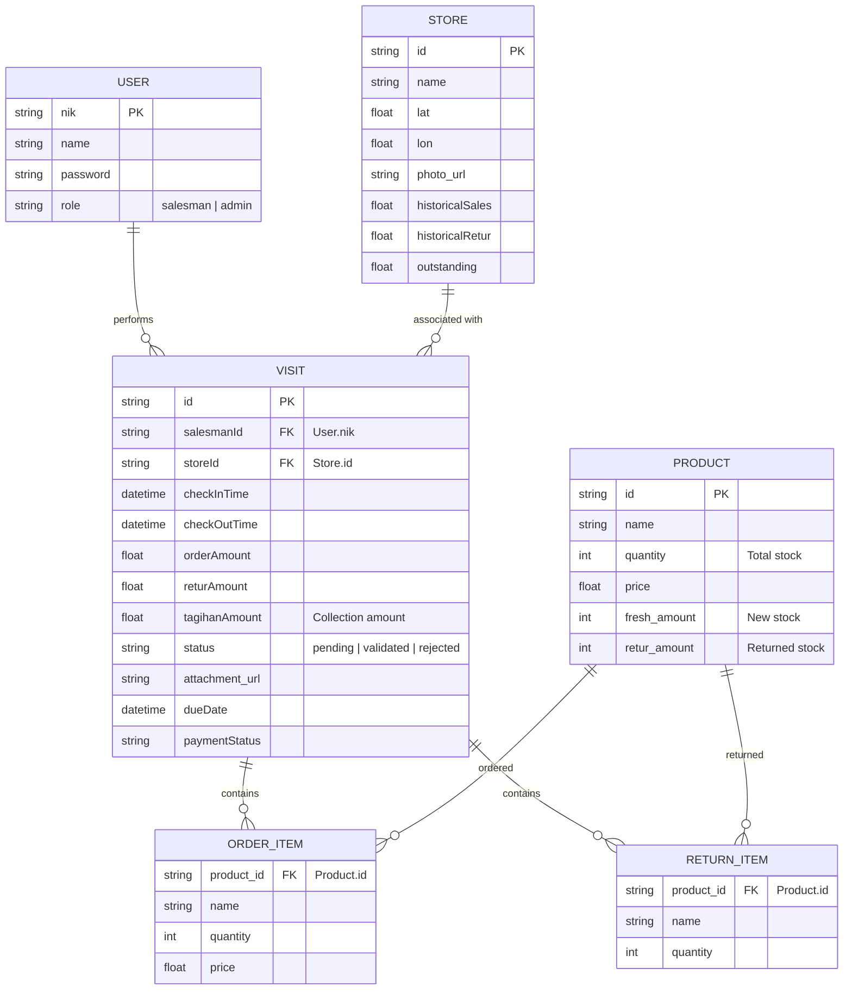

# Data Relationships Documentation

This document outlines the data structure and relationships within the Sales Monitoring System, presented in a database table style.

## Entity Relationship Overview

The system manages users, stores, products, and sales visits. The core of the application revolves around the **Visit** entity, which links salesmen (users), stores, and products (through items and returns).

---

## Detailed Table Definitions

### 1. Users (`dummy_users`)
Stores information about the system users (Salesmen and Admins).

| Column | Type | Constraints | Description |
| :--- | :--- | :--- | :--- |
| **nik** | String | **Primary Key** | Unique identifier (e.g., employee ID). |
| **name** | String | | Full name of the user. |
| **password** | String | | Login password. |
| **role** | String | | User role: `salesman` or `admin`. |

### 2. Stores (`dummy_stores`)
Stores information about the retail locations visited by salesmen.

| Column | Type | Constraints | Description |
| :--- | :--- | :--- | :--- |
| **id** | String | **Primary Key** | Unique UUID. |
| **name** | String | | Store name. |
| **lat** | Float | | Latitude coordinate. |
| **lon** | Float | | Longitude coordinate. |
| **photo_url** | String | | Path to the store photo. |
| **historicalSales** | Float | | Sum of all validated order amounts for this store. |
| **historicalRetur** | Float | | Sum of all validated return amounts for this store. |
| **outstanding** | Float | | Current unpaid balance for this store. |

### 3. Products (`dummy_products`)
Inventory management table.

| Column | Type | Constraints | Description |
| :--- | :--- | :--- | :--- |
| **id** | String | **Primary Key** | Unique ID (e.g., `p1`). |
| **name** | String | | Product name. |
| **quantity** | Integer | | Total stock (`fresh_amount + retur_amount`). |
| **price** | Float | | Unit price. |
| **fresh_amount** | Integer | | Available new stock. |
| **retur_amount** | Integer | | Stock returned from stores (unsaleable or for refurb). |

### 4. Visits (`visits_db`)
The central transaction table tracking salesman activities at stores.

| Column | Type | Constraints | Description |
| :--- | :--- | :--- | :--- |
| **id** | String | **Primary Key** | Unique ID (timestamp-based). |
| **salesmanId** | String | **Foreign Key** | References `Users.nik`. |
| **storeId** | String | **Foreign Key** | References `Stores.id`. |
| **checkInTime** | DateTime | | ISO timestamp of check-in. |
| **checkOutTime** | DateTime | | ISO timestamp of check-out. |
| **orderAmount** | Float | | Total value of products sold. |
| **returAmount** | Float | | Total value of products returned. |
| **tagihanAmount** | Float | | Amount of cash collected during visit. |
| **status** | String | | `pending`, `validated`, or `rejected`. |
| **attachment_url** | String | | Optional link to visit proof (photo/receipt). |
| **dueDate** | DateTime | | 3 days after check-in if order is unpaid. |
| **paymentStatus** | String | | Calculated status: `Full Payment`, `Partial Payment`, `Unpaid`, `Collection Only`. |
| **items** | List | | Nested list of Order Items. |
| **returns** | List | | Nested list of Return Items. |

### 5. Order Item (Nested in Visit)
Products sold during a specific visit.

| Column | Type | Constraints | Description |
| :--- | :--- | :--- | :--- |
| **product_id** | String | **Foreign Key** | References `Products.id`. |
| **name** | String | | Snapshot of product name at time of sale. |
| **quantity** | Integer | | Number of units sold. |
| **price** | Float | | Price at time of sale. |

### 6. Return Item (Nested in Visit)
Products returned during a specific visit.

| Column | Type | Constraints | Description |
| :--- | :--- | :--- | :--- |
| **product_id** | String | **Foreign Key** | References `Products.id`. |
| **name** | String | | Snapshot of product name at time of return. |
| **quantity** | Integer | | Number of units returned. |

---

## Data Flow & Calculation Logic

1.  **Stock Adjustment**:
    - On **Visit Creation**: `Product.fresh_amount` decreases by `OrderItem.quantity`, and `Product.retur_amount` increases by `ReturnItem.quantity`.
    - On **Visit Rejection/Deletion**: Stock levels are reverted to their previous state.
2.  **Financial Updates**:
    - Store balances (`outstanding`, `historicalSales`, `historicalRetur`) are **only updated** when a visit status changes to `validated`.
    - If a validated visit is edited, the store balance is reverted before applying new values to ensure consistency.
3.  **Payment Status**:
    - `Net Payable = OrderAmount - ReturAmount`.
    - If `TagihanAmount >= Net Payable` -> `Full Payment`.
    - If `0 < TagihanAmount < Net Payable` -> `Partial Payment`.
    - If `TagihanAmount == 0` -> `Unpaid`.
